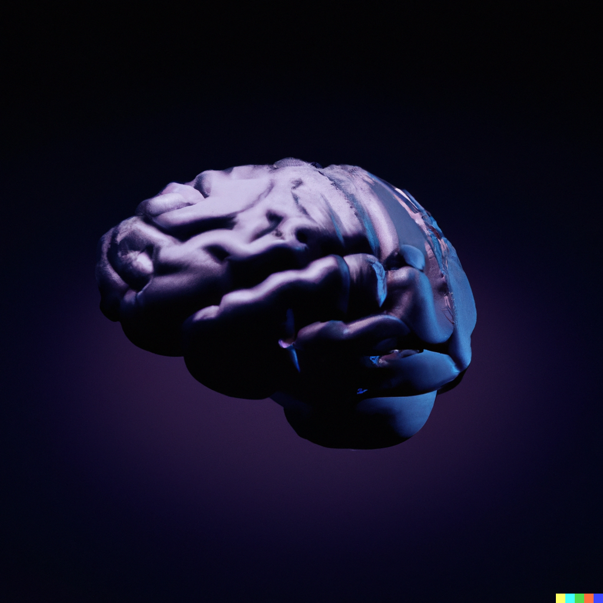

  

# Frxderic

 - 

 - 

## About Me
Hi, i'm Frederic, a neurosurgical resident and dedicated researcher specializing in clinical research using artificial intelligence and data analysis tools. With a strong focus on the intersection of neurosurgery and artificial intelligence, my work aims to help healthcare through integration of cutting-edge algorithms and tools from both worlds. With a growing network of international collaborators, my team and me strive to bring together diverse perspectives and expertise to drive impactful discoveries and improve patient outcomes.

---

<h2 align="center">Projects</h2>

### Neuroimaging using AI
I am part of multiple research groups and currently focusing on projects leveraging artificial intelligence to enhance neuroimaging analysis. By developing new and integrating already validated algorithms and techniques, we aim to automate the extraction and analysis of intricate neuroimaging features, enabling comprehensive investigations into brain structure and function - both pathological and physiological. With these improvements we hope to pave the way for more accurate diagnoses and personalized treatment strategies.

### Microscopy Image Analysis using AI
In collaboration with esteemed institutions in Germany and the USA, I have started projects utilizing AI for microscopy image analysis. By harnessing advanced machine learning algorithms specifically designed for segmenting microscopy images, our main objective is to enhance the efficiency of swiftly and accurately identifying cellular and subcellular structures and pathological features to create objetive and quantifiable data from unstructured images. These projects are accelerating discoveries in basic research and improving precision in the assessment of pathological changes.

### Clinical Data Analysis using Machine Learning and Data Science Algorithms
In my research endeavors, I extensively employ machine learning and data science algorithms to analyze complex clinical datasets. By leveraging these powerful tools, we have gained valuable insights, identified patterns, and made informed decisions in various clinical research domains. These projects have contributed to - and continue to do so - enhanced treatment strategies and advanced medical knowledge.

---

<h2 align="center">Tools</h2>
I possess a strong programming background, specializing in Python and the scientific Python stack. Proficient in widely-used machine learning libraries, I employ these tools to develop robust models and perform in-depth data analysis. Additionally, I have some knowledge in JavaScript, including frameworks such as React, Three.js, and Next.js. For a demonstration see also my <a href="https://portfolio-49236.web.app/">personal portfolio</a>. In the field of neuroimaging, I have also experience in open-source and proprietary software such as MITK, 3D Slicer, ITK Snap and the BrainLab imaging suite enabling comprehensive analysis of brain imaging data.

---

<h2 align="center">Collaborations</h2>
I have had the privilege of collaborating with prestigious institutions such as the University Hospital Munich and the Mayo Clinic in Rochester. These collaborations have left a significant impression in the way i wish to conduct research and contribute to the advancements in the fields or neurosurgery, neurooncology and artificial intelligence in the healthcare domain.

---

<h2 align="center">Cooperations</h2>
If you are interested in collaborating on clinical and basic research projects, I welcome opportunities for cooperation. As Hellen Keller once said:
`"Alone we can do so little; together we can do so much."`

Let's connect and shape the future of healthcare and research!
